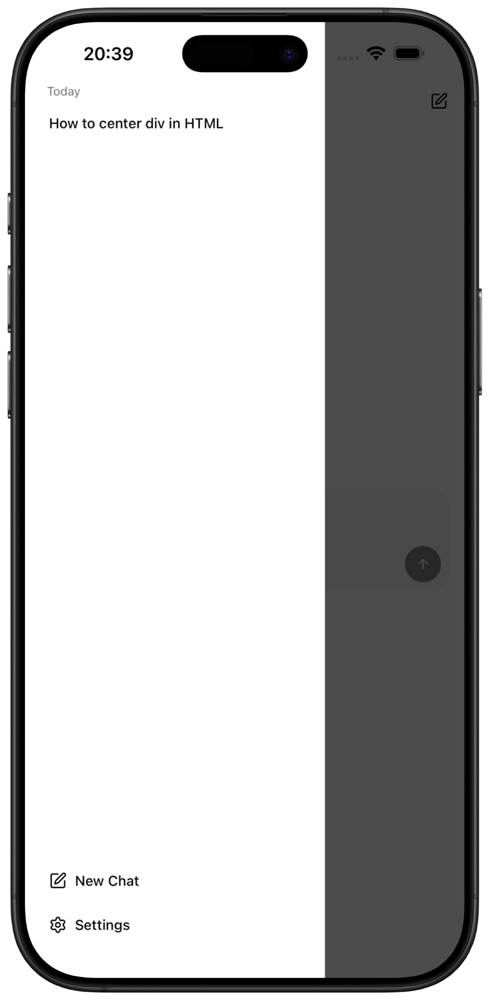
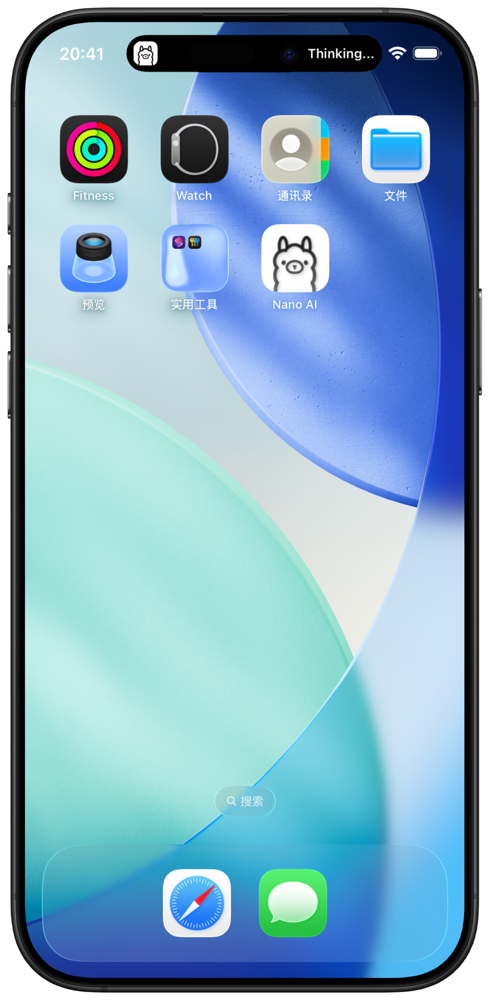
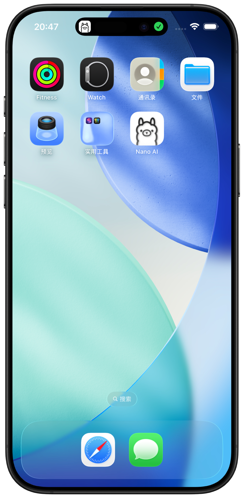
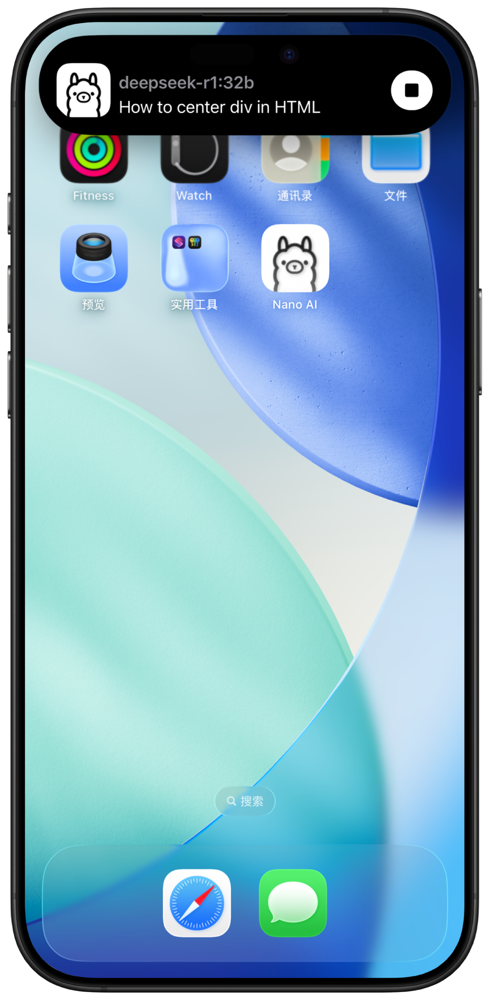

# Nano AI

Nano AI is a modern cross-platform chat client for [Ollama](https://ollama.com/) built with [React Native](https://reactnative.dev/). It delivers a native-quality experience on every device while keeping conversations fast and private.

## Download

- [iOS](https://apps.apple.com/us/app/nano-ai-for-ollama/id6755102943)
- Android: WIP...
- [macOS/Windows/Linux](https://ollama.com/download) (official)

## Feature Highlights

1. **Native-quality interface** — Clean, unified UI that feels just like the official clients.

  

2. **Zero-friction onboarding** — Focused on the essentials so you can start chatting immediately.

  
  

3. **Local-first privacy** — Chats and settings never leave the device.

4. **Thinking mode toggle** — Quickly enable [thinking mode](https://docs.ollama.com/capabilities/thinking) whenever deeper reasoning is needed.

  

5. **Streaming replies** — Watch answers stream in token by token for instant feedback.

6. **Dark mode everywhere** — A polished experience that respects system theme preferences.

  

7. **Rich Markdown rendering** — Code blocks, tables, LaTeX, and more render beautifully.

  
  

8. **Persistent chat history** — Jump back into any conversation instantly.

  

9. **Live Activities** — Follow ongoing chats directly from the home/lock screen.

  
  
  

## Inspired by

- [Ollama](https://ollama.com/)
- [Swift Chat](https://github.com/aws-samples/swift-chat)
- [Reins](https://github.com/ibrahimcetin/reins)

## Powered by

- [React Native](https://reactnative.dev/)
- [Expo](https://expo.dev/)
- [@react-native-reusables](https://reactnativereusables.com/)
