# Nano AI

Nano AI is a modern cross-platform chat client for [Ollama](https://ollama.com/) build with [React Native](https://reactnative.dev/).

## Features

1. Beautiful and unified UI. 100% official-like apps.

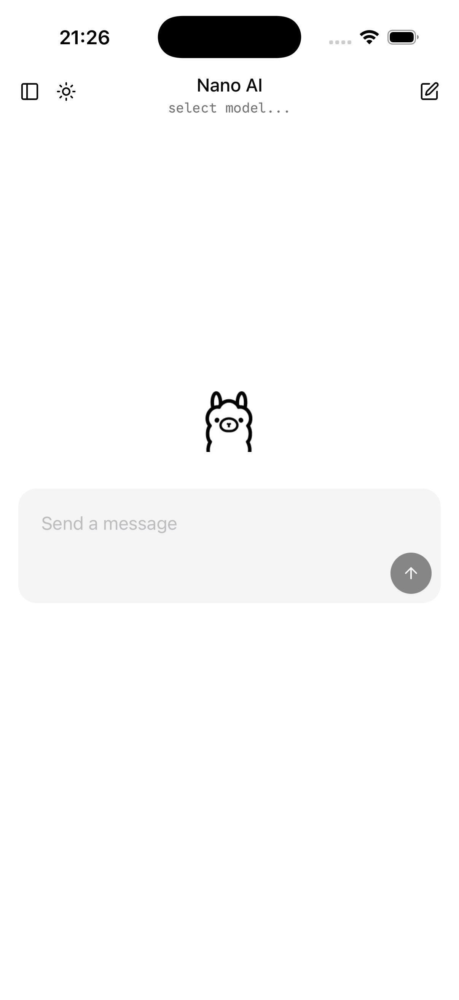
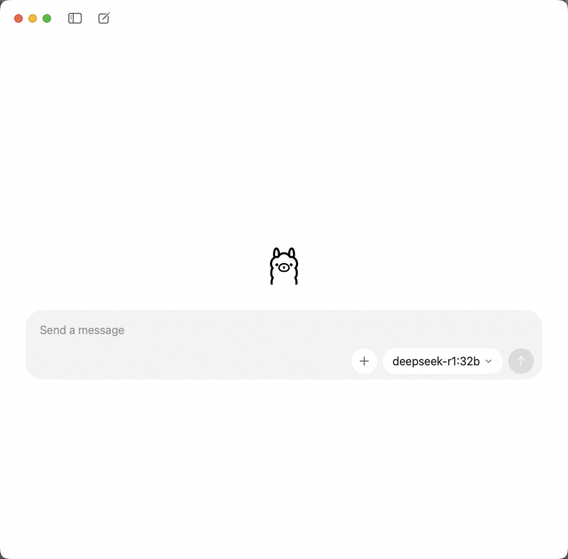

2. Easy to use. Just focus on the essential features only, 0 learning barrier.

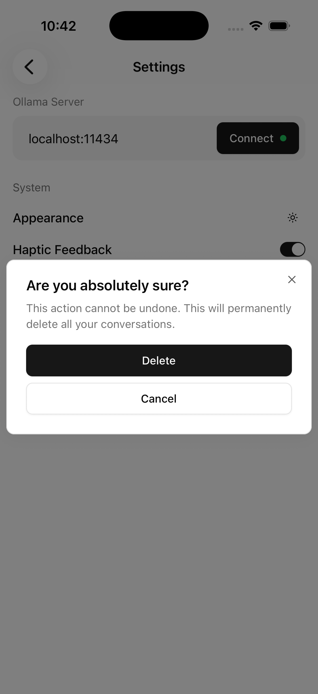

3. [Thinking mode](https://docs.ollama.com/capabilities/thinking) switch supported.

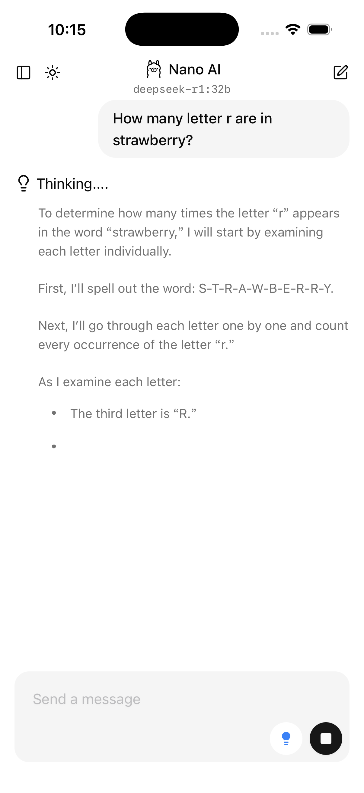
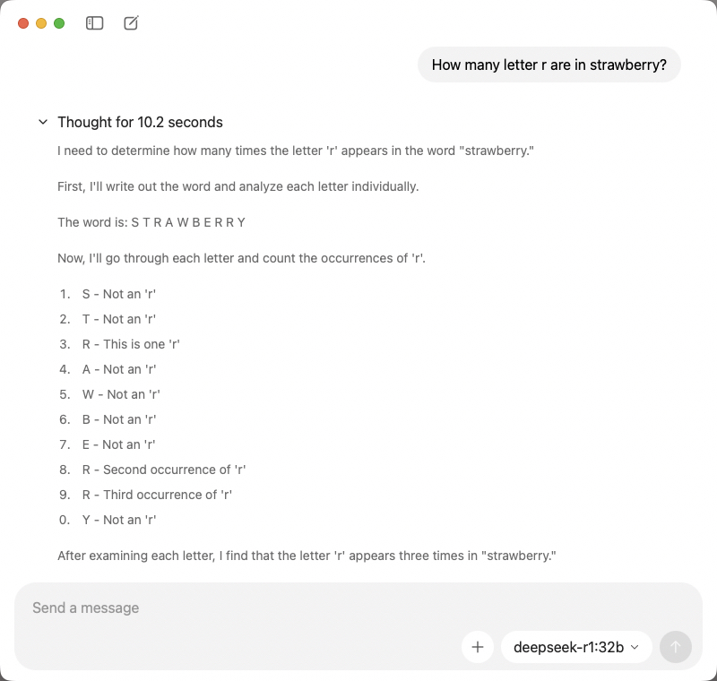

4. Streaming response supported.
5. Dark mode supported.

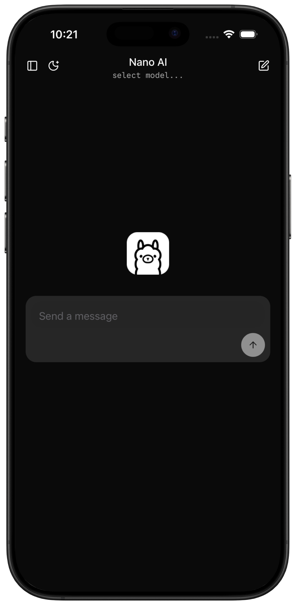
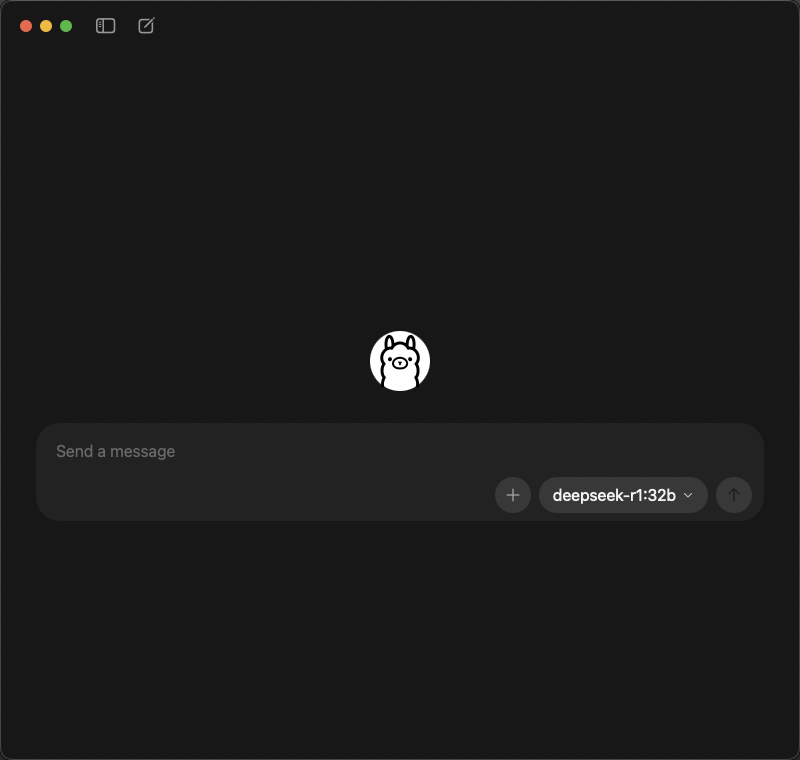

6. Rich markdown syntax supported. Codes, Tables, LaTex...

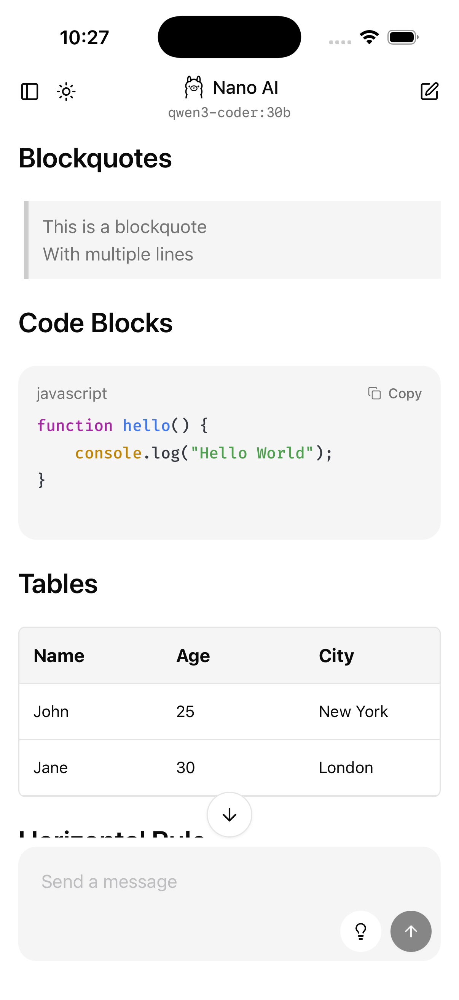
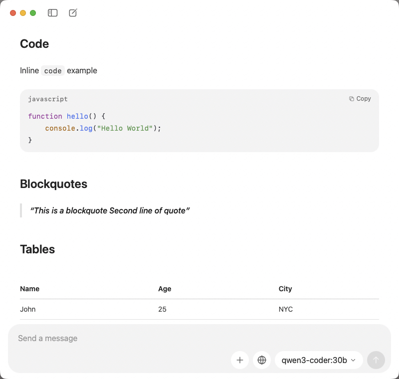

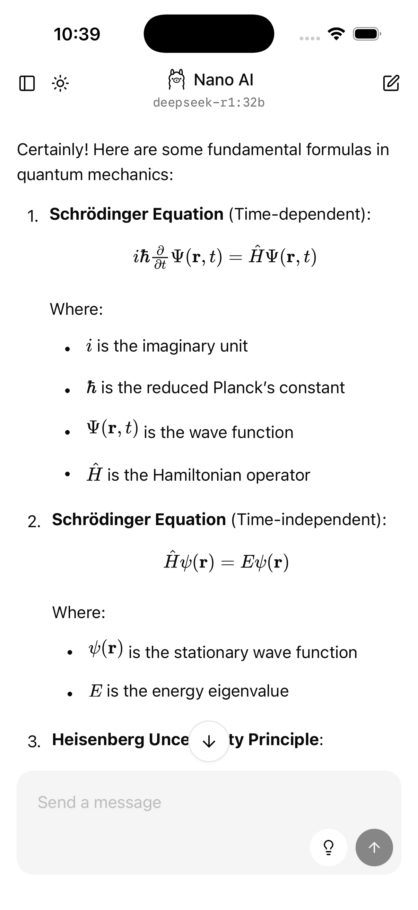
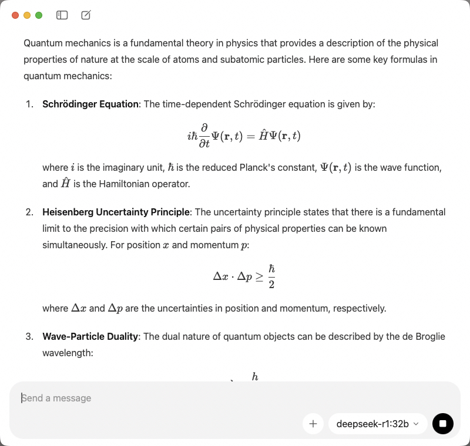

7. Chats history supported.

## Inspired by

- [Ollama](https://ollama.com/)
- [Swift Chat](https://github.com/aws-samples/swift-chat)
- [Reins](https://github.com/ibrahimcetin/reins)

## Powered by

- [React Native](https://reactnative.dev/)
- [Expo](https://expo.dev/)
- [@react-native-reusables](https://reactnativereusables.com/)
